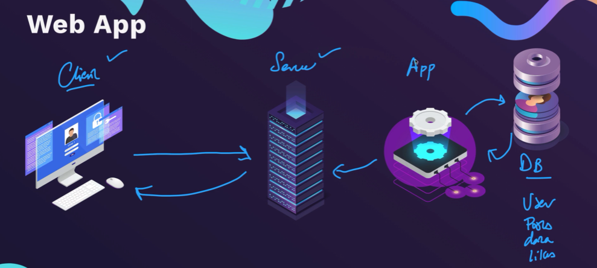

PostgreSQL is a powerful, open source object-relational database system with over 35 years of active development that has earned it a strong reputation for reliability, feature robustness, and performance.

There is a wealth of information to be found describing how to install and use PostgreSQL through the official documentation. The open source community provides many helpful places to become familiar with PostgreSQL, discover how it works, and find career opportunities. Learn more on how to engage with the community.

url: [text](https://www.postgresql.org/)

In order to start we must download two peaces of software.
1. Postgres Server(Local Server): https://sbp.enterprisedb.com/getfile.jsp?fileid=1258649
2. pgAdmin

